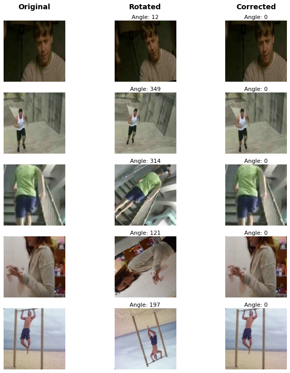
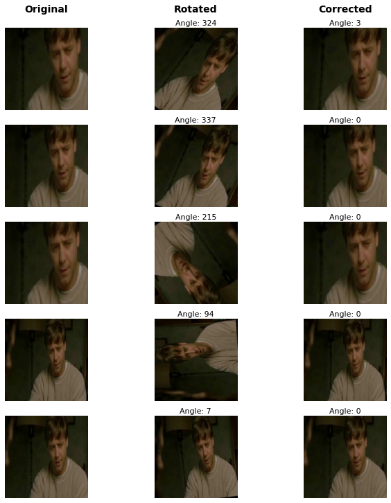

# OrienNet
#### Correct orientation of incorrectly captured photos and videos. 
#### Description
Deep Learning model to correctly rotate video clips with human presence at the best suitable angle.
#### Use case
Video clips captured at abnormal angles are not amenable with most of the deep learning models that are trained on rightly oriented videos and images. Rotating video at a correct angle can ease the training process and improve the performance of vision-based models. 
#### Model Architecture
Multi-class classification model where classes are any integer value between 0 and 360. ResNet50 model pre-trained on ImageNet is used along with a dense output layer with 360 units. 
#### Data sets
##### Model is train on below data sets. 
1. HMDB51 - Human Motion Database (51 classes)
2. UCF101 - University of Central Florida (101 classes)
3. Charades
##### Some more data sets that may be used.
1. ActivityNet
2. Kinetics
3. AVA Actions
4. Hollywood2
5. VGG Human Pose Estimation
6. Charades
#### Model
Download the model from this link - https://drive.google.com/file/d/1P2T9UA58bKrhe1XSA5DqUhWyg1NxVoVN/view?usp=sharing
#### Run
###### 1. Training
1. Change the below at line number 15 in train/train_men_standing.py to the location of all training images.

     `dataset_file = "<location to train data>"`
 
2. To start the training, run 

    `python train.py`

>Images used in training are extracted from aforementioned video dataset. Dataset can be prepared by using any key frame extractor on video dataset. 
###### 2. Inference 
1. Change the below at line number 20 in inference.py to the location of model weights.'

    `model_location = "<model_hdf5_file_location>"`
2. To get rotation angle on a video - run

    `python inference.py -u <media_url>`
#### Results
###### Training 
1. Error - 0.10
2. Angle loss - 2 degree
###### Validation
1. Error - 0.22
2. Angle loss - 3 degree
###### Test
1. Error ~ 0.5 to 4 depending on video set
2. Angle loss ~ 4 to 10 degree
#### Inference
Results on few human containing images

#####Different images at random angels

#####Same Image at random angels

